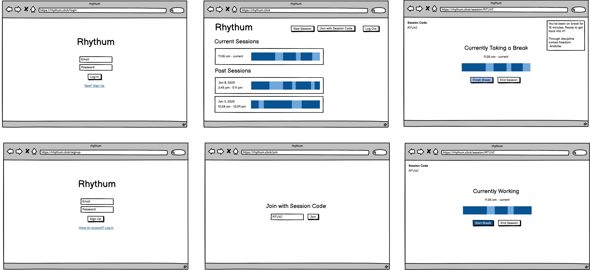

# Rhythum

## Elevator Pitch
Do you ever try and take a quick study break only to find yourself distracted over an hour later? Rhythum is a tool to help you log your study sessions, so you understand where your time is going and stay on track.

## Key Features

#### Study sessions
Create a study session to track studying and taking breaks for a period of time. At any time you can switch between study and break mode. The blue summary bar will show you your time studying (dark blue) and your time taking breaks (light blue) over the course of the session.

#### Back on track reminders
After 15 minutes of taking a break, you'll get a notification to remind you to resume studying. Included in that notification is an inspirational quote to help you stay motivated for your next section of studying.

#### Session history
Once a session has ended, it goes into your list of past sessions. You can view these past sessions at any time.

#### Group sessions
Wanting to stay on track while studying with a group of friends? You can join another user's session using their session code. All users can view the session summary and start/end breaks.

## Technology breakdown
* HTML - Proper HTML pages for the login/signup page, list view, session detail page, and join with code page.
* CSS - Styling for the overall page layout and spacing, as well as the session progress bars.
* JavaScript - Allows for logging in/out, creating/joining sessions, starting/finishing breaks, ending sessions, and receiving notifications.
* React - Enables easier state management as well as more modular components, such as the summary bar or session info component.
* Service - Backend service with endpoints for:
  * Registering users
  * Logging users in
  * Logging users out
  * Getting all sessions
  * Creating a session
  * Joining a existing session
  * Ending a session
  * Starting/ending a break
* 3rd Party Service - Using https://zenquotes.io/ to get inspirational quotes to display in notifications.
* DB/Login
  * Users have an email, password (hashed), and a list of sessions. Users are able to login/logout with their email and password.
  * Sessions have a list of users, a list of timestamps for when breaks started/ended (sessions always start with studying), a flag for whether the session has ended, and a code to let other users join with.
* WebSocket - Information about starting/ending breaks or ending a session will be sent to all users in a session via WebSockets.

## Rhythum Design

---

## HTML deliverable
In this deliverable I built the structure of Rhythum with HTML.

- [x] HTML pages - I have a log in, sign up, list view, session view, and join session page, which represents all the pages for my website.
- [x] Links - Each page has links to other pages so the overall flow of the site is similar to how it will be once it's done.
- [x] Text - There is text for various headers, buttons, and links. There is also text for the notification and session date/time.
- [x] Images - I have an image for the logo. I am also representing the blue summary bars as images for now.
- [x] DB/Login - I have login and sign up pages which both have fields for inputting credentials. The session information will also be coming from the database.
- [x] 3rd Party Service - I have text representing a notification on the session view. The quote will come from a 3rd party API.
- [x] WebSocket - Clicking to start/finish a break or end a session will use WebSockets so other users can be in the same session as you.